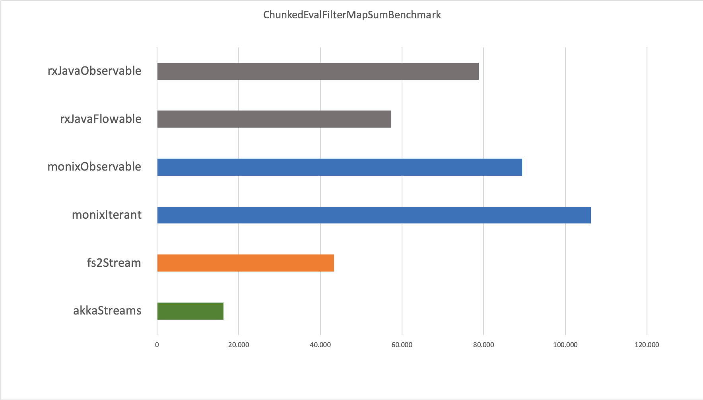

# Results 2018-11-18

## ChunkedEvalFilterMapSumBenchmark

Results:

| Subject           |  Throughput |       Error |
|-------------------|------------:|------------:|
| akkaStreams       |      16.249 |     ± 0.114 |
| fs2Stream         |      43.392 |     ± 1.377 |
| monixIterant      |     106.282 |     ± 2.616 |
| monixObservable   |      89.435 |     ± 9.043 |
| rxJavaFlowable    |      57.353 |     ± 1.736 |
| rxJavaObservable  |      78.765 |     ± 0.827 |



Sample:

```scala
Iterant[Task]
  // 1: iteration
  .fromSeq(allElements)
  // 2: collect buffers
  .bufferTumbling(chunkSize)
  // 3: eval map
  .mapEval(seq => Task(sumIntScala(seq)))
  // 4: filter
  .filter(_ > 0)
  // 5: map
  .map(_.toLong)
  // 6: foldLeft
  .foldLeftL(0L)(_ + _)
```


